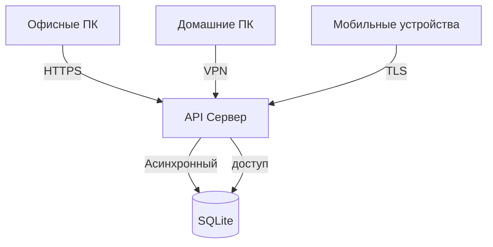

# Employee Database API (FastAPI + SQLite)

Асинхронное REST API для управления базой данных сотрудников с использованием FastAPI и SQLite. Вариант, когда сотрудники, работающие с базой могут выполнять действия каждый на своём рабочем месте и не зависимо от других, а так же и удалённо.  

## 📋 Возможности
- Создание и инициализация таблицы при запуске  
- Добавление сотрудников через JSON API  
- Просмотр всех записей с расчетом возраста  
- Генерация тестовых данных (1M+ записей)  
- Поиск мужчин с фамилией на "F"  
- Оптимизация БД с замерами производительности  
- Полностью асинхронная реализация  
- Централизованное хранение данных  
- Параллельная работа множества пользователей  
- Встроенная документация Swagger и ReDoc  

## ⚙️ Зависимости
Установите зависимости (для сервера):
```bash
pip install fastapi uvicorn aiosqlite
```

## 🚀 Запуск сервера
```bash
uvicorn main:app --host 0.0.0.0 --port 8000 --reload
```
Сервер будет доступен по адресу: http://127.0.0.1:8000


## 📊 Документация API
После запуска сервера доступна интерактивная документация:  
Swagger UI: http://127.0.0.1:8000/docs  
ReDoc: http://127.0.0.1:8000/redoc  


## 📚 API Endpoints
Основные методы:

| Метод | Эндпоинт                       | Описание                       |
|-------|--------------------------------|--------------------------------|
| GET   | /                              | Главное меню API               |
| GET   | /employees/                    | Получить всех сотрудников      |
| POST  | /employees/                    | Добавить нового сотрудника     |
| POST  | /employees/generate-test-data/ | Сгенерировать тестовые данные  |
| GET   | /employees/male-f/             | Найти мужчин с фамилией на "F" |
| POST  | /employees/optimize/           | Оптимизировать БД              |


## 📌 Примеры запросов
1. Добавление сотрудника:
```bash
curl -X POST "http://127.0.0.1:8000/employees/" \
     -H "Content-Type: application/json" \
     -d '{"full_name": "Ivanov Ivan", "birth_date": "1990-05-15", "gender": "M"}'
```

2. Получение всех сотрудников:
```bash
curl "http://127.0.0.1:8000/employees/"
```

3. Генерация тестовых данных:
```bash
curl -X POST "http://127.0.0.1:8000/employees/generate-test-data/?count=1000000&special=100"
```

4. Поиск мужчин на "F":
```bash
curl "http://127.0.0.1:8000/employees/male-f/"
```

5. Оптимизация БД:
```bash
curl -X POST "http://127.0.0.1:8000/employees/optimize/"
```

## 🖥️ Клиентское приложение
Для удобства работы с API предусмотрен CLI клиент.  
Установите зависимости (для клиента):  
```bash
pip install requests
```
Запуск клиента:  
```bash
python client.py
```
После запуска клиентского приложения будет выведено меню:
```text
=== Employee Database ===  
1. Создать таблицу (автоматически при запуске)  
2. Добавить сотрудника  
3. Показать всех сотрудников  
4. Сгенерировать тестовые данные  
5. Найти мужчин с фамилией на F  
6. Оптимизация базы  
0. Выход  
========================  
```


## 📁 Структура проекта
```text
employee-api/
├── main.py               # FastAPI приложение
├── client.py             # CLI клиент
├── employees.db          # Файл базы данных SQLite
├── README.md             # Документация
└── requirements.txt      # Зависимости
```


## 🔄 Развертывание
**Для production использования рекомендуется:**  
Использовать Gunicorn + Uvicorn workers  
Настроить PostgreSQL вместо SQLite  
Добавить аутентификацию  

**Пример запуска в production:**  
```bash
gunicorn -w 4 -k uvicorn.workers.UvicornWorker -b 0.0.0.0:80 --timeout 120 main:app
```


## 🌟 Production рекомендации
1. Используйте PostgreSQL вместо SQLite  
2. Настройте аутентификацию  
3. Включите HTTPS  
4. Настройте регулярные бэкапы  


## 🌟 Преимущества системы
✔️ Нет локальных копий базы - защита от утечек  
✔️ Работа из дома, офиса или в дороге  
✔️ Одновременное редактирование разными сотрудниками  
✔️ История изменений для аудита  
✔️ Резервное копирование на сервере  


## 📌 Особенности реализации
Полностью асинхронная архитектура  
Валидация данных через Pydantic  
Автоматическая документация OpenAPI  
Простое масштабирование для больших нагрузок  


## ⚙️ Техническая реализация


